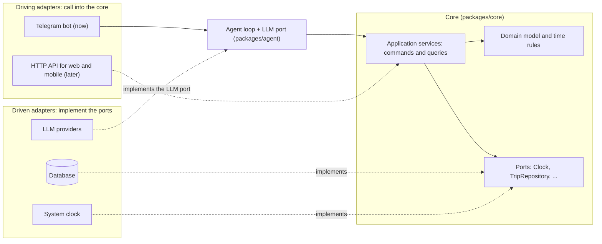
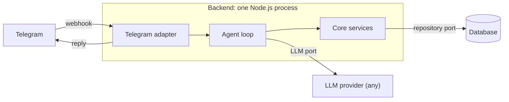
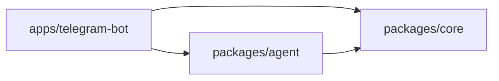
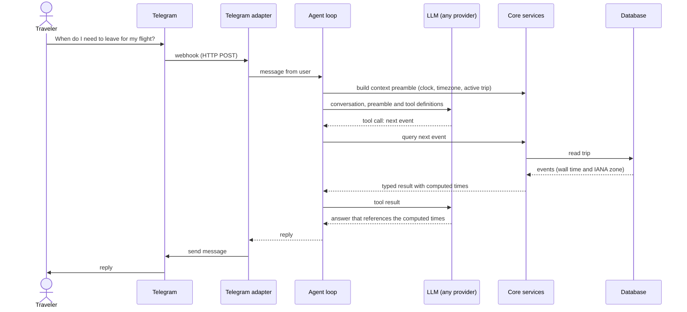

# Architecture

A living map of the system. Update it in the same change whenever a slice moves a boundary.

## Bird's-eye view

Users talk to the agent through a chat channel, starting with Telegram. Each message reaches our backend, which runs an **agent loop**:

1. Code builds a context preamble: the current time, the user's timezone, the active trip.
2. The conversation goes to a language model, together with a list of tools it may use.
3. Whatever tools the model asks for run as our own deterministic code.
4. The reply goes back to the user.

The trip plan lives in a database and changes only through the core's services.

Two ideas shape everything:

- **The model is a client of deterministic tools.** It never computes times or invents facts that change; it calls code that does.
- **The core is the centre of a hexagon.** All business logic lives in `packages/core`, which knows nothing about Telegram, HTTP, databases or LLM vendors. Everything else is an adapter around it.

## The hexagon (ports and adapters)

- **Ports** are interfaces that describe what a side needs: "give me the current time", "load this user's trips", "complete this conversation". The side that needs a port defines it. The core defines the Clock and the repositories; the agent defines the LLM port, because the core never talks to a model.
- **Driving adapters** turn an outside event (a Telegram message, a future HTTP request) into calls to the core's services.
- **Driven adapters** implement ports with real technology: a database, the system clock, a specific LLM provider. Tests swap them for fakes (a fixed clock, an in-memory database, a scripted model).

### Rules that keep the core untouched

1. **The core depends on nothing.** It doesn't import other packages, apps, Node built-ins, or Telegram, HTTP, LLM-vendor or database libraries. [.dependency-cruiser.cjs](.dependency-cruiser.cjs) enforces this, and it runs in the git hooks and in CI.
2. **Core services speak domain language only.** They take a `userId` or a `tripId`, never a Telegram chat id or an HTTP request. Each adapter maps its own identities to a user.
3. **Every plan change goes through a core service.** The agent's tools are thin wrappers over those services, and a future web API calls the same ones, so validation, previews and the change log are shared by all callers. A test enforcing this arrives in slice 2, when changes exist.
4. **Driven adapters live in the app that wires the program together**, today `apps/telegram-bot`. When a second app needs them, they move into a shared package.

### Adding a client later

| New client           | What gets added                                                                                                                                                                                                                                                                     | Core changes |
| -------------------- | ----------------------------------------------------------------------------------------------------------------------------------------------------------------------------------------------------------------------------------------------------------------------------------- | ------------ |
| Web or mobile app    | `apps/api` (an HTTP adapter calling the core services; login mapped to a user). `packages/contracts` (request and response shapes shared with the client). The client itself (`apps/web` or `apps/mobile`). The database adapter moves to a shared package so both apps can use it. | None         |
| Another chat channel | `apps/<channel>-bot`, reusing the agent and rendering replies for that channel                                                                                                                                                                                                      | None         |

## Runtime

What actually runs: one Node.js process, one database and an external LLM provider.

## Code map

| Folder                    | Contains                                                                                  | May not import                                                                         |
| ------------------------- | ----------------------------------------------------------------------------------------- | -------------------------------------------------------------------------------------- |
| `packages/core`           | Domain model, time rules, application services, ports (Clock, repositories)               | Anything else in the repo, Node built-ins, Telegram/HTTP/LLM-vendor/database libraries |
| `packages/agent`          | Agent loop, tools (thin wrappers over core services), prompts, context preamble, LLM port | Apps                                                                                   |
| `apps/telegram-bot`       | Telegram adapter, driven adapters (database, clock, LLM provider), program entry point    | Other apps                                                                             |
| `apps/web`, `apps/mobile` | Reserved; no code yet                                                                     | —                                                                                      |

`pnpm deps:graph` prints the actual current graph.

## One message, end to end

An illustrative example. The real tool names are defined in the slice 1 spec.

## Invariants

| Invariant                                                         | Enforced by                                                |
| ----------------------------------------------------------------- | ---------------------------------------------------------- |
| The core depends on nothing and stays technology-agnostic         | dependency-cruiser rules                                   |
| The core runs outside Node (browser, React Native)                | No Node types in packages; `core-no-node-builtins` rule    |
| No code reads the system clock; a Clock is injected               | ESLint `no-restricted-properties` / `no-restricted-syntax` |
| Times shown to users are computed by code, not typed by the model | Output check and evals (slice 1)                           |
| The plan changes only through core services                       | Architecture test (slice 2)                                |

## Where decisions live

- [docs/product.md](docs/product.md): what we're building and for whom.
- [docs/roadmap.md](docs/roadmap.md): the slices, in order.
- `docs/slices/`: one short spec per slice, written just before building it.
- [docs/adr/](docs/adr/): decisions that are costly to reverse.
- [docs/learning/glossary.md](docs/learning/glossary.md): the concepts used here.
