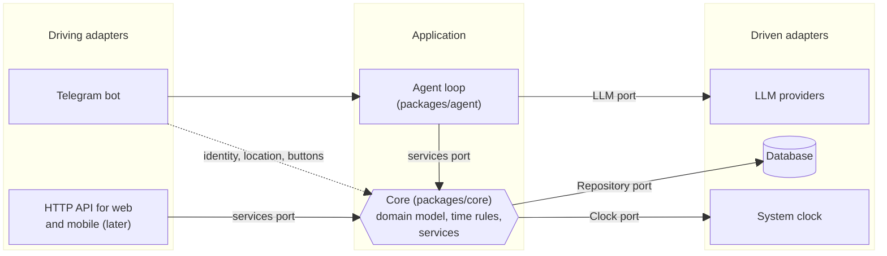
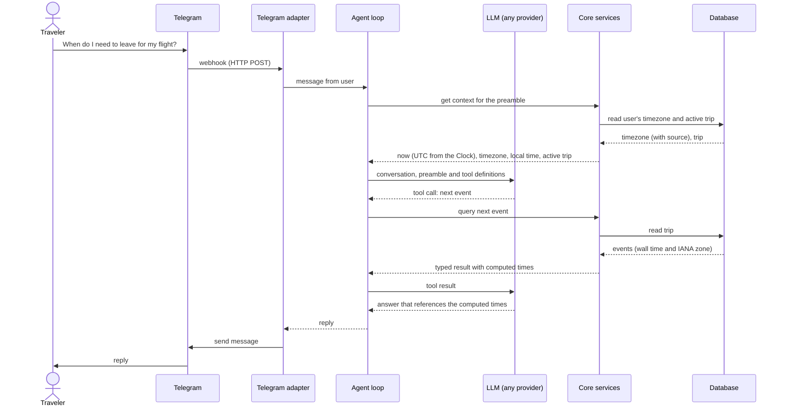

# Architecture

How the system is put together. Update it whenever a slice moves a boundary.

## Overview

You talk to the agent in Telegram. Each message goes through an **agent loop**:

1. Code builds a context preamble: the current time, your timezone, the active trip.
2. The conversation and a list of tools go to a language model.
3. Whatever tools the model asks for run as our own deterministic code.
4. The loop replies.

The model never computes times or invents facts that change; it calls code that does.

The trip plan lives in a database and changes only through the core's services. At runtime everything is a single Node.js process: the Telegram adapter plus the Application box below. The database and the LLM provider are external.

## Ports and adapters

- **Application:** all the logic and no technology. The core holds the business rules; the agent holds the conversation loop.
- **Driving adapters** call the application.
  - Telegram messages go to the agent.
  - Things that need no language understanding go straight to the core: identifying the user, shared locations, and button taps such as **Confirm**.
  - A future HTTP API calls the core's services directly, with no LLM involved.
- **Driven adapters** implement the application's outbound **ports**, which are interfaces for what the application needs. The core defines the Clock and the repositories; the agent defines the LLM port. Tests replace these adapters with fakes.

The arrows show who calls whom at runtime. Code dependencies always point inwards, so the application never imports an adapter.

## Rules

1. **The core depends on nothing:** no other package, app or Node built-in, and no Telegram, HTTP, LLM or database library. Enforced by dependency-cruiser.
2. **Core services speak domain language** (`userId`, `tripId`), never Telegram or HTTP concepts. Adapters map identities.
3. **Every plan change goes through a core service.** Agent tools wrap these services, and a future web API calls the same ones. A test arrives in slice 2.
4. **Only the user confirms a change.** Button taps go from the adapter straight to the core, so nothing the model has read can approve a change. A test arrives in slice 2.
5. **No code reads the system clock;** a Clock is injected. Enforced by ESLint.
6. **Times shown to users are computed by code,** never typed by the model. An output check and evals arrive in slice 1.
7. **Driven adapters live in `apps/telegram-bot`** until a second app needs them.

## Adding a client

- **Web or mobile app:** add `apps/api` (an HTTP adapter over the core services), `packages/contracts` (the shapes shared with the client) and the client app itself. Move the database adapter into a shared package. The core doesn't change.
- **Another chat channel:** add `apps/<channel>-bot`, reusing the agent. The core doesn't change.

## One message, end to end

This is illustrative. The real tool names come with the slice 1 spec.

