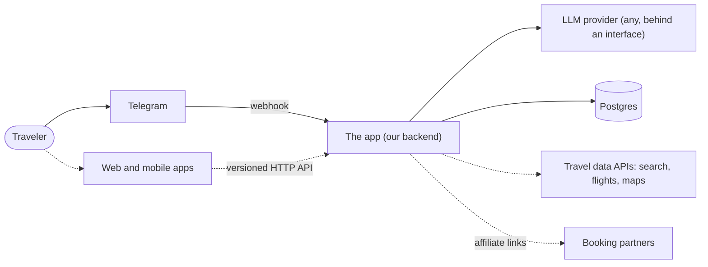
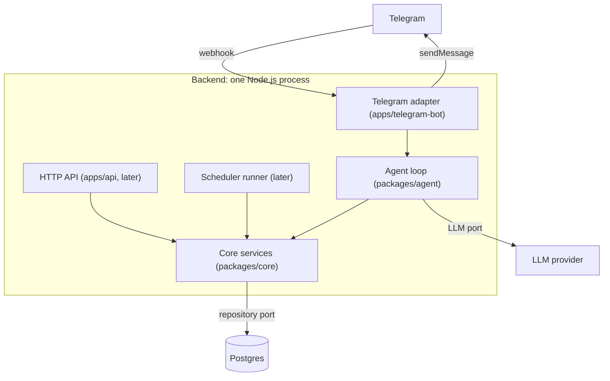
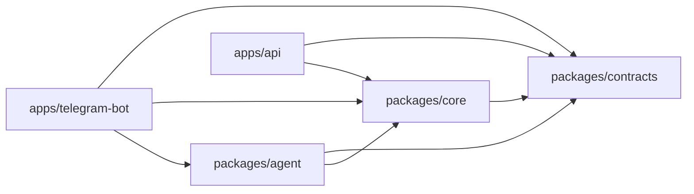
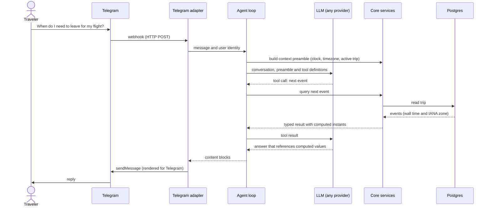

# Architecture

> **Status: provisional.** This map describes the intended design. The Phase 2 Architecture Decision Records (ADRs) will confirm or change it; until then, ADRs and specs take precedence over this file.

## Bird's-eye view

Users talk to the agent through a chat channel, starting with Telegram. Each incoming message reaches our backend, which runs an **agent loop**:

1. Build a context preamble in code (current time, the user's timezone, the active trip).
2. Send the conversation, plus a list of available tools, to a language model.
3. Execute whatever tool calls the model requests against our own deterministic code.
4. Return structured content blocks that the channel adapter renders.

The trip plan lives in Postgres. It changes only through validated commands in the core, and those same commands will later serve a web and a mobile client through an HTTP API, with no LLM involved.

Two ideas shape everything:

- **The model is a client of deterministic tools.** It never computes times or invents facts that change; it calls code that does.
- **Channels are adapters at the edge.** The core knows nothing about Telegram, HTTP or any LLM vendor. Adding a client means adding an adapter.

## 1. System context

Solid lines are planned for the first slices; dashed lines come later.

## 2. Runtime

What actually runs: at first, a single Node.js process with separate entry points, so the pieces can be split into separate processes later without code changes.

## 3. Code map

Folders are libraries (`packages/`) or programs (`apps/`). Imports only point down this graph. [.dependency-cruiser.cjs](.dependency-cruiser.cjs) enforces it, and `pnpm deps:check` runs in the git hooks and in CI. `pnpm deps:graph` prints the actual current graph.

| Folder                    | Contains                                                                                                          | May not import                                                      |
| ------------------------- | ----------------------------------------------------------------------------------------------------------------- | ------------------------------------------------------------------- |
| `packages/contracts`      | Shared schemas (zod) and API types, also used by future clients                                                   | Any other package                                                   |
| `packages/core`           | Domain model, time logic, application services (commands and queries), ports (Clock, repositories, Notifier, LLM) | `agent`, apps, Node built-ins, channel/HTTP/LLM-vendor/DB libraries |
| `packages/agent`          | Agent loop, tool definitions (thin wrappers over core services), prompts, context preamble                        | Apps                                                                |
| `apps/telegram-bot`       | Telegram channel adapter, an entry point                                                                          | Other apps                                                          |
| `apps/api`                | Versioned HTTP API for future clients, an entry point                                                             | Other apps                                                          |
| `apps/web`, `apps/mobile` | Reserved; no code yet                                                                                             | —                                                                   |

## 4. One message, end to end

The example below is illustrative. Tool names and shapes will be defined in `docs/specs/03-tool-contracts.md` during Phase 1.

## Invariants

These hold everywhere. Each one is backed by a check, or will be once the code exists.

| Invariant                                                   | Enforced by                                                |
| ----------------------------------------------------------- | ---------------------------------------------------------- |
| Core is channel-, transport-, vendor- and storage-agnostic  | dependency-cruiser rules                                   |
| No code reads the system clock; a Clock is injected         | ESLint `no-restricted-properties` / `no-restricted-syntax` |
| Core runs outside Node (browser, React Native)              | No Node types in packages; `core-no-node-builtins` rule    |
| The plan is mutated only through application services       | Architecture test (Phase 3)                                |
| Times shown to users come from tool results, not model text | Output guard and evals (Phase 3–4)                         |
| Outbound messages are content blocks, not channel strings   | Channel-adapter conformance suite (Phase 3)                |

## Where decisions live

- [docs/adr/](docs/adr/): why things are the way they are.
- [docs/specs/](docs/specs/): what the system must do (Phase 1).
- [docs/learning/glossary.md](docs/learning/glossary.md): the concepts used here.
